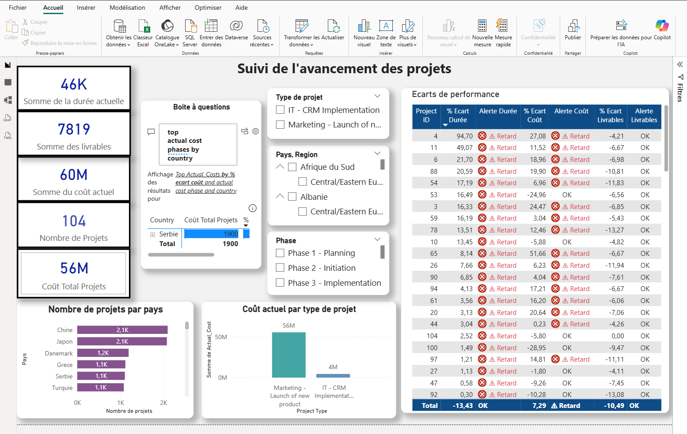
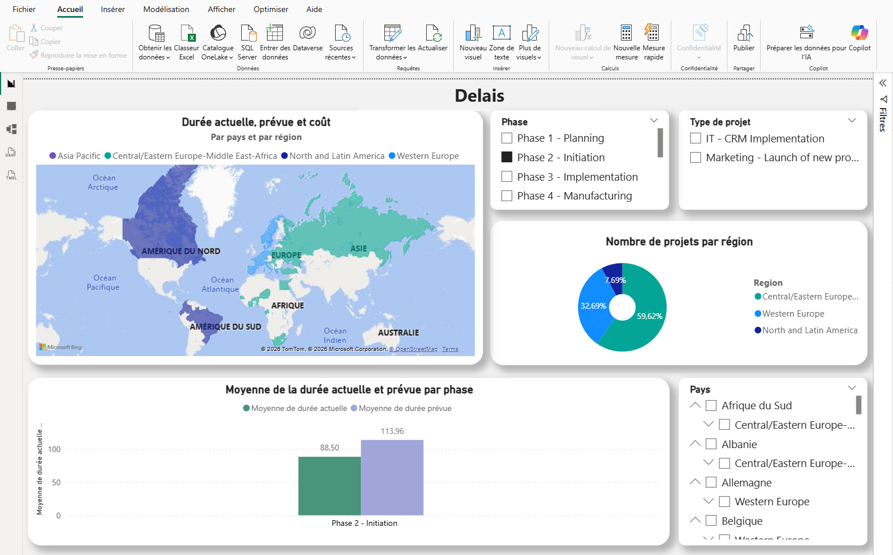
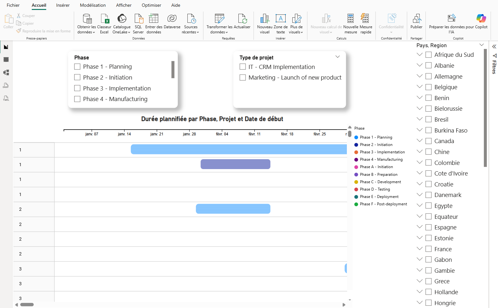

[Version française en bas / French version below]

# 📌 Power BI – Project Dashboard (Project Monitoring)

## 🎯 Project Objective

This project consists of designing an interactive dashboard to monitor projects within an international company, enabling analysis of costs, timelines, and deliverables.

It demonstrates my ability to turn raw data into clear, actionable insights to support business decision-making using Power BI.

---

## 🛠️ Tools Used

- Power BI  
- Power Query  
- DAX  
- Data Modeling  

---

## 📊 Dashboard Features

- End-to-end tracking of project costs, durations, and deliverables  
- Key Performance Indicators (KPIs) for overall project performance  
- Automatic alerts for deviations (15% threshold)  
- Dynamic filters (country, region, project type, phase)  
- Performance analysis by geographic area  
- Role-based access (CEO, Regional Manager, Country Manager)  

---

## 🧠 Data Modeling

The data model is built on a relational structure with a central project table connected to cost, duration, deliverables, and location tables.

This structure ensures data consistency, scalability, and efficient analysis.

---

## 🔄 Data Refresh

The report is connected to Excel sources.  
A simple refresh in Power BI automatically updates all metrics and visuals.

---

## 🚀 Skills Demonstrated

Power BI · Power Query · DAX · Data Modeling · Data Visualization · Business Intelligence · Data Cleaning · KPI Design · Dashboard Development

---

## 📷 Dashboard Preview

Project performance dashboard providing a global overview of ongoing projects, including cost, duration, and deliverables tracking. It enables stakeholders to monitor project progress, identify delays, and analyze performance across countries and project types :

  

Map-based and performance analysis of project delays, comparing planned vs actual duration and costs across countries and regions. The dashboard helps identify underperforming areas and highlights regional trends in project execution :

 

Interactive Gantt chart displaying project timelines by phase, showing planned schedules, start dates, and project execution progress. This view provides a clear visualization of project planning and timeline management :

---

# 📌 Power BI

## 🎯 Objectif du projet :

Ce projet consiste à créer un tableau de bord interactif pour le suivi des projets d’une entreprise internationale, permettant d’analyser les coûts, les délais et les livrables.

This project demonstrates my ability to transform raw data into actionable business insights using Power BI.

---

## 🛠️ Outils utilisés :

- Power BI
- Power Query
- DAX
- Modélisation de données

---

## 📊 Fonctionnalités du dashboard :

- Suivi des coûts, durées et livrables des projets
- KPI de performance globale
- Alertes sur les écarts (seuil de 15%)
- Filtres dynamiques (pays, région, type de projet, phase)
- Analyse des performances par zone géographique
- Gestion des rôles (Directeur Général, Régional, Pays)

---

## 🧠 Modélisation des données :

Le modèle repose sur une structure relationnelle avec une table centrale de projets reliée aux tables de coûts, durées, livrables et localisation.

---

## 🔄 Mise à jour des données :

Le rapport est connecté à des fichiers Excel.
Une simple actualisation dans Power BI permet de mettre à jour automatiquement l’ensemble des indicateurs.

---

## 🚀 Compétences acquises :

Power BI · Power Query · DAX · Data Modeling · Data Visualization · Business Intelligence · Data Cleaning

---

## 📷 Aperçu du dashboard :

